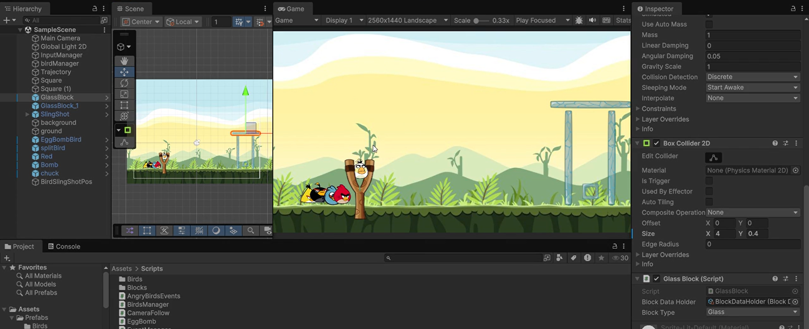

# 🐦 Angry Birds Clone (Unity 6)

A **2D physics-based Angry Birds style game** built in **Unity 6** using **Rigidbody2D**, custom **slingshot mechanics**, destructible structures, TNT interactions, and bird ability architecture.

> 🚧 **Project Status: In Development** Need to create levels core gamePlay logic is ready

## 🎥 Gameplay Demo

>
> This project is currently under active development. Core gameplay systems are functional, while additional birds, pig AI, level progression, VFX polish, UI, scoring, and optimization are still being added.

---

## ✨ Current Features

* 🎯 Slingshot drag and launch system
* 🐦 Abstract `BaseBird` architecture for reusable bird abilities
* 💥 TNT explosive object support
* 🧱 Physics-based wood / stone / glass style blocks
* 📈 Trajectory preview system
* 🎥 Camera follow support (WIP)
* 🔁 Event-driven bird lifecycle system
* 🐷 Pig target destruction flow (WIP)
* 🏗️ Modular level building with sprite atlases

---

## 🧠 Architecture Highlights

The project is built with **clean reusable systems**:

* `BaseBird` → shared bird logic
* `IBirdAbility` → bird ability contract
* `EventManager` → decoupled gameplay events
* `InputManager` → sling input handling
* `Trajectory` → launch prediction
* `BirdManager` → bird queue / turns

This makes it easy to add:

* Red Bird
* Bomb Bird
* Split Bird
* Speed Bird
* Boomerang Bird

without rewriting launch code.

---

## 🛠️ Built With

* **Unity 6**
* **C#**
* **2D Physics (Rigidbody2D / Collider2D)**
* **Sprite Atlas workflow**
* **Custom event system**

---

## 🚀 Planned Features

* ✅ Multiple bird abilities
* ✅ Better destruction feedback
* ⏳ Pig damage health system
* ⏳ Level win / lose conditions
* ⏳ Score stars system
* ⏳ Sound FX and particles
* ⏳ Camera cinematic transitions
* ⏳ Level loader / progression
* ⏳ Mobile touch controls

---

## 📌 Development Note

This repository reflects an **ongoing learning + production-style prototype** focused on:

* clean architecture
* scalable gameplay systems
* reusable Unity patterns
* polished 2D physics interactions

Expect frequent updates as systems evolve.

---

## 🤝 Contributions

Feedback, architecture suggestions, and gameplay ideas are welcome while the project is still in development.

---

## ⭐ Status

> 🚧 **Early Development / Prototype Phase**

The current version focuses mainly on **core slingshot gameplay and physics interactions**.
